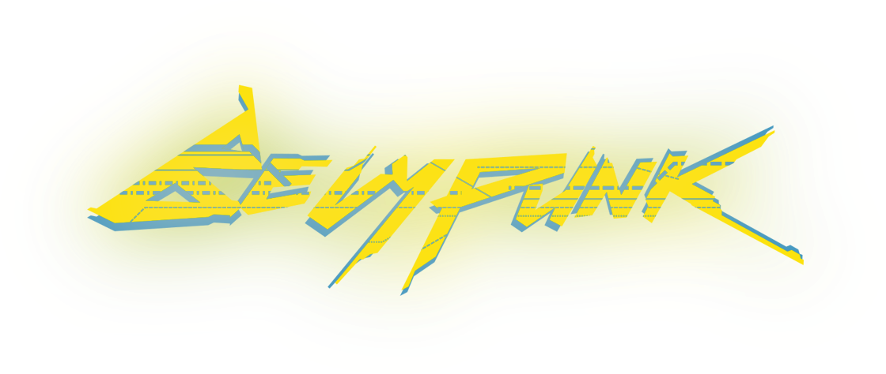
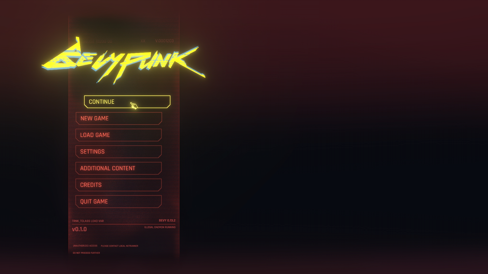
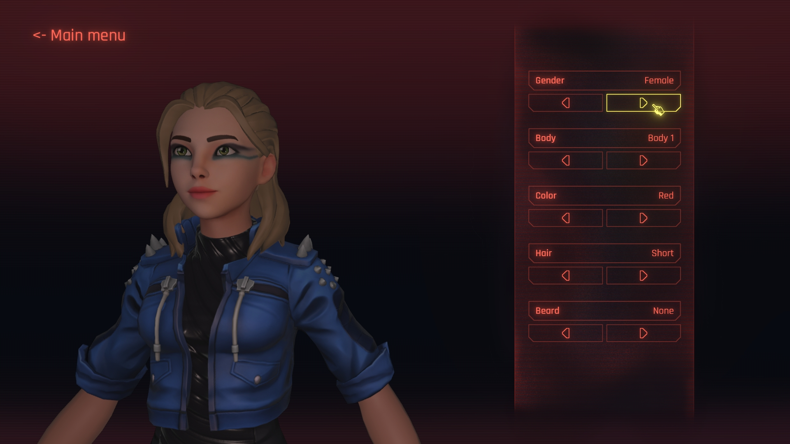
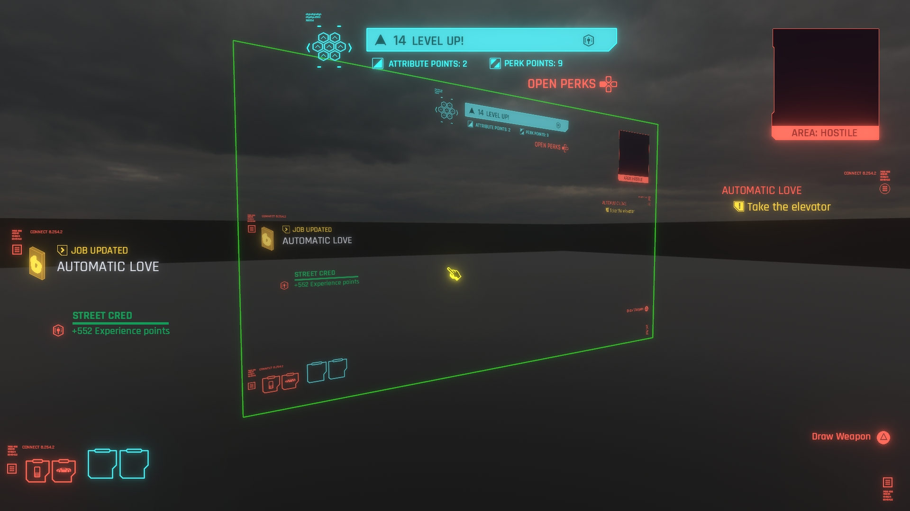

  
  
  

#

This repository is a recreation of ***Cyberpunk*** UI in ***Bevy*** using **[`Bevy-Lunex`](https://github.com/bytestring-net/bevy_lunex)** crate.

This project is intended to be production ready example/template for Bevy. It highlights the following features:

- **Project structure** - Learn how properly structure your code to be modular and ready for professional games.
* **Animated intro** - Take a look at how to load a video ahead of time and play it before the start of the game.
- **Game navigation UI** - Learn how to create a good looking user interfaces like main menus, options screens, inventories, etc.
* **Preferences & Settings** - Learn how to manage application settings in Bevy like window properties, camera settings, audio, graphics, etc.
- **Worldspace UI** - Learn how to add interactive holograms, huds, and floating billboards to your game.

#

https://github.com/IDEDARY/Bevypunk/assets/49441831/f417d411-63ff-46c1-a0e0-74233b73e7ca

> *Try out the live WASM demo on [`Itch.io`](https://idedary.itch.io/bevypunk) (Limited performance & stutter due to running on a single thread). For best experience compile the project natively.*

## Credits

Assets used:
 * Logo svg : [Nicola Papale](https://github.com/nicopap)
 * Images   : Recreated by [1D3D4RY](https://github.com/IDEDARY) in Krita and Aseprite
 * Fonts    : [Rajdhani](https://fonts.google.com/specimen/Rajdhani) - provided by *Google Fonts*
 * Music    : [AffectEffect - V Theme cover on Youtube](https://youtu.be/t4XllslwbYc?si=yOS-MXzFvecrIgNc)

 * Male1: [SketchFab](https://sketchfab.com/3d-models/full-body-cyberpunk-male-65c441d2146c49a1af115bceb1588727) - CC Attribution-NonCommercial-ShareAlike
 * Male2: [SketchFab](https://sketchfab.com/3d-models/ready-player-me-male-avatar-ca294f737d0b4293bb29bfcd8a0a27dd) - CC Attribution-NonCommercial-ShareAlike
 * Male3: [SketchFab](https://sketchfab.com/3d-models/readyplayerme-cyberpunk-5881c7e4431d44058325b4be4d8d30dc) - CC Attribution-NonCommercial-ShareAlike
 * Female1: [SketchFab](https://sketchfab.com/3d-models/female-full-body-cyberpunk-themed-avatar-7a8fa15955084fa3bf7103ed1818c584) - CC Attribution-NonCommercial-ShareAlike
 * Female2: [SketchFab](https://sketchfab.com/3d-models/readyplayerme-cyberpunk-bc1e5da743a24625a554f7293fe7a323) - CC Attribution-NonCommercial-ShareAlike
 * Female3: [SketchFab](https://sketchfab.com/3d-models/readyplayerme-cyberpunk-f8dc753a6dc1482590c1bc993b41c42e) - CC Attribution-NonCommercial-ShareAlike

## Contributing

Any contribution submitted by you will be dual licensed as mentioned below, without any additional terms or conditions. If you have the need to discuss this, please contact me.

## Licensing

The **CODE** is released under both [APACHE](./LICENSE-APACHE) and [MIT](./LICENSE-MIT) licenses. Pick one that suits you the most!

> [!CAUTION]
> **THE ASSETS ARE NOT COVERED BY THE LICENSE!**
> - The assets included in this repository are independently created and are not affiliated with, endorsed by, or connected to CD Projekt Red.
> - The assets are provided solely for educational and demonstration purposes to accompany this repository.
> - You are not permitted to use these assets for any other purpose, including but not limited to commercial use, redistribution, or standalone projects.

If you have any questions or concerns regarding the use of this repository, please reach out.